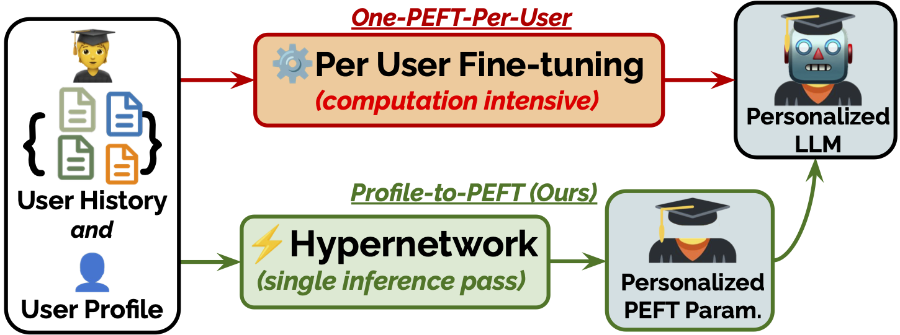
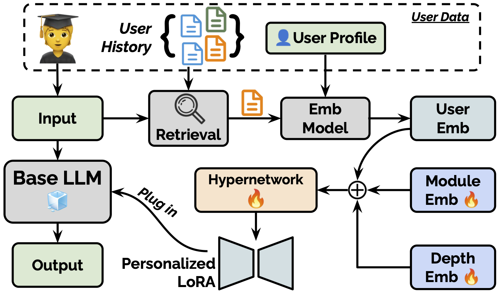

# [Instant Personalized Large Language Model Adaptation via Hypernetwork](https://zhaoxuan.info/p2p.github.io/)
<div align="center">
    :scroll:<a href="https://www.arxiv.org/abs/2510.16282">Paper</a> |
    :hugs:<a href="https://huggingface.co/Zhaoxuan/P2P_ckpt">Hugging Face (Model)</a> |
    :hugs:<a href="https://huggingface.co/Zhaoxuan/P2P_ckpt">Hugging Face (Data)</a> |
    :octocat:<a href="https://github.com/TamSiuhin/P2P">GitHub</a>
<br>A reference implementation of Profile-to-PEFT (P2P).<br>

**Authors:** [Zhaoxuan Tan](https://zhaoxuan.info/), [Zixuan Zhang](https://zhangzx-uiuc.github.io/), [Haoyang Wen](https://haoyangwen.com/), [Zheng Li](https://hsqmlzno1.github.io/), [Rongzhi Zhang](https://rongzhizhang.org/), [Pei Chen](https://scholar.google.com/citations?user=9sOFHvcAAAAJ&hl=en), [Fengran Mo](https://fengranmark.github.io/), [Zheyuan Liu](https://zheyuanliu.github.io/), [Qingkai Zeng](https://qingkaizeng.github.io/), [Qingyu Yin](https://scholar.google.com/citations?user=P-mBKNYAAAAJ&hl=zh-CN), [Meng Jiang](http://www.meng-jiang.com/)
</div>
<div align="center">
    
</div>

---

<h1 align="center">🛠️ Installation</h1>

Install `uv` if you don't have `uv` (see https://docs.astral.sh/uv/getting-started/installation/)

With `uv` installed, run the following to install the dependencies.
```bash
git clone https://github.com/TamSiuhin/P2P.git
cd p2p
# make sure you have `uv` installed
# (see https://docs.astral.sh/uv/getting-started/installation/)
uv self update
uv venv --python 3.10 --seed
uv sync
# we use the following wheel for installation
# you might have to change the wheel to be compatible with your hardware
uv pip install https://github.com/Dao-AILab/flash-attention/releases/download/v2.6.3/flash_attn-2.6.3+cu123torch2.3cxx11abiFALSE-cp310-cp310-linux_x86_64.whl
uv pip install src/fishfarm
uv pip install openai rank-bm25
```

---
<h1 align="center">🏋️ Training</h1>
<div align="center">
    
</div>

## Download Dataset

We store the processed dataset on [huggingface](https://huggingface.co/datasets/Zhaoxuan/P2P_data). The data processing code can be found in `./data_p13n` directory. Download the data using the following command

```bash
uv run huggingface-cli login
uv run huggingface-cli download Zhaoxuan/P2P_data --local-dir ./data_p13n/P2P_data
```


## Setup Embedding Model API

We use the vllm to serve the embedding model for faster inference. Due to the version camparibility, we use the docker `vllm/vllm-openai:v0.10.0`. 

```bash
docker pull vllm/vllm-openai:v0.10.0
bash launch_vllm_emb.sh
```

After setting up the embedding model api, we then run the following script for a hypernetwork training using one GPU (80G A100 in our experiment).
```bash
bash scripts/uv_train_p2p_qwen_unified.sh
```


---
<h1 align="center">📊 Baselines and Evluation</h1>

Base model
```bash
bash ./scripts/eval_base_models_qwen.sh
```

Retrieval-Augmented Generation (RAG)
```bash
bash ./scripts/eval_RAG_models.sh
```

Profile-Augmented Generation (PAG)
```bash
bash ./scripts/eval_PAG_model.sh
```

All History Prompting
```bash
bash ./scripts/eval_all_history_models.sh
```

Multi-task LoRA (MT-LoRA)
```bash
bash train_mt_lora_qwen_baselines.sh
```

One-PEFT-Per-User (OPPU)
```bash
bash train_oppu_baselines.sh
```

---
<h1 align="center"> Trained Model</h1>

You can download the trained model [here](https://huggingface.co/Zhaoxuan/P2P_ckpt).

## Acknolwedgement

Our codebase is built upon the [Text-to-LoRA](https://github.com/SakanaAI/text-to-lora) repo. Thanks for the great work!

---

# 📖 BibTex
If you find our code useful for your research, please kindly cite the following paper.
```bibtex
@article{tan2025instant,
  title={Instant Personalized Large Language Model Adaptation via Hypernetwork},
  author={Tan, Zhaoxuan and Zhang, Zixuan and Wen, Haoyang and Li, Zheng and Zhang, Rongzhi and Chen, Pei and Mo, Fengran and Liu, Zheyuan and Zeng, Qingkai and Yin, Qingyu and others},
  journal={arXiv preprint arXiv:2510.16282},
  year={2025}
}
```
